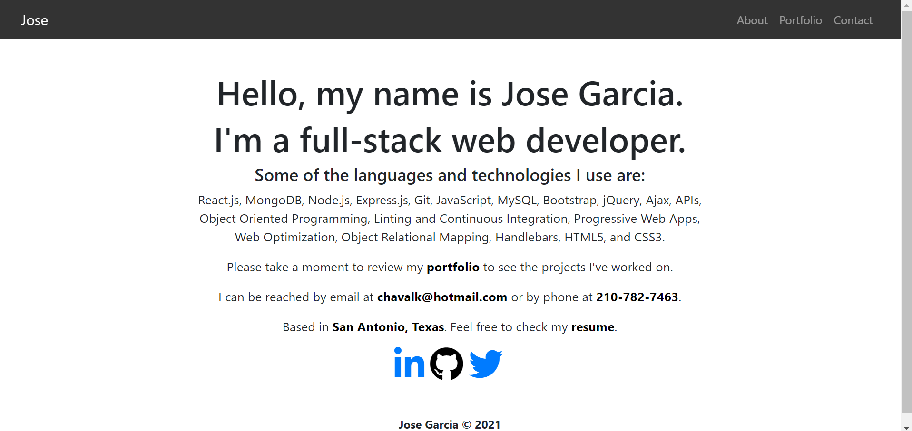
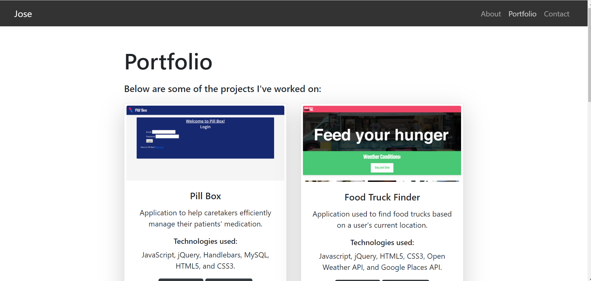
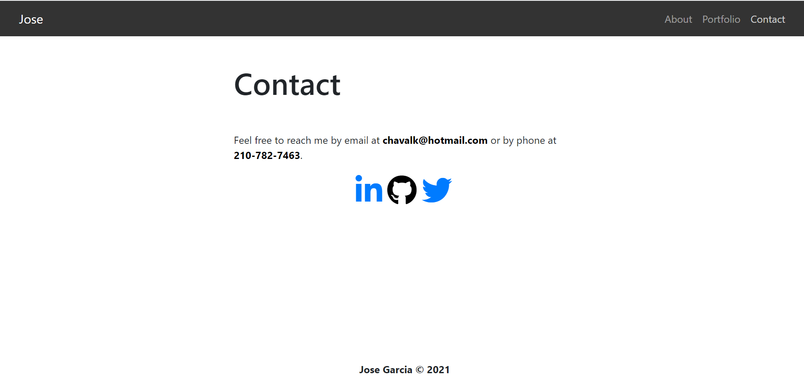

# react-portfolio

## Description

React Portfolio is an application built entirely with React.js. It involved taking an earlier version of my portfolio website built with HTML5 and CSS3 and building it from the ground up with React.js. Under the hood, the application has a pages folder for the about page, the portfolio page, and the contact page. It also takes advantage of using components in react to have a component for the nav bar, a component for the footer, and a component for building the project cards. The application uses React HashRouter instead of BrowserRouter in order to allow the deployment to GitHub pages. HashRouter is the one that facilitates rendering the different pages.

Below is a screenshot of the about page in the application:

Below is a screenshot of the portfolio page:

Below is a screenshot of the contact page:

## Table of Contents

* [Installation](#installation)
* [Usage](#usage)
* [License](#license)
* [Contributing](#contributing)
* [Tests](#tests)
* [Questions](#questions)

## Installation

There's no need to install this application. Simply navigate to the deployed version below to see it in action.

https://chavalk.github.io/react-portfolio/#/

## Usage

This project's primary purpose was to continue to get experience building applications with React.js and also to experience refactoring an existing application built with HTML5 and CSS3 to work with React.js.

## License

[MIT](https://choosealicense.com/licenses/mit/)

## Contributing

Contributions are currently not accepted for this application.

## Tests

There is no testing available within the application.

## Questions

My GitHub username is: chavalk

Link: https://github.com/chavalk

If you have additional questions, feel free to reach me at chavalk@hotmail.com.